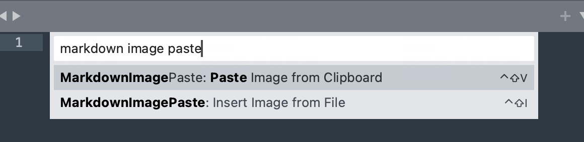

# Sublime Markdown Image Paste

> **⚠️ macOS Only**: This plugin currently supports macOS only.

A powerful Sublime Text plugin for seamlessly pasting and inserting images into Markdown files. Automatically saves clipboard images and generates proper Markdown image links with flexible path configuration.



## ✨ Features

- 🖼️ **Clipboard Image Paste**: Directly paste images from clipboard into Markdown files
- 📁 **File Image Insert**: Insert local image files with automatic copying
- 🗂️ **Flexible Path Configuration**: Support for relative paths, absolute paths, and environment variables
- 🎯 **Smart Context Detection**: Only active in Markdown files
- ⚙️ **Highly Configurable**: Customize file naming, storage location, and link generation
- 🔧 **Auto Directory Creation**: Automatically creates image storage directories

## 🚀 Quick Start

### Paste from Clipboard
1. Copy an image (screenshot, web image, etc.)
2. Position cursor in your Markdown file
3. Press `Ctrl+Shift+V` or use Command Palette → "MarkdownImagePaste: Paste Image from Clipboard"

### Insert from File
1. Position cursor in your Markdown file
2. Press `Ctrl+Shift+I` or use Command Palette → "MarkdownImagePaste: Insert Image from File"
3. Enter the complete file path in the input panel

## ⚙️ Configuration

Configure the plugin by editing `MarkdownImagePaste.sublime-settings`:

```json
{
    // Image storage path configuration
    // Relative: relative to current markdown file, e.g. "images" or "../assets/images"
    // Absolute: full path, e.g. "/Users/username/Documents/blog/images"
    // Environment variables supported, e.g. "$HOME/Pictures/blog"
    "image_folder": "images",
    
    // Image filename prefix
    "image_prefix": "image",
    
    // Include timestamp in filename
    "include_timestamp": true,
    
    // Include unique ID in filename
    "include_unique_id": true,
    
    // Default alt text for images
    "default_alt_text": "Image",
    
    // Supported image formats
    "supported_formats": ["*.png", "*.jpg", "*.jpeg", "*.gif", "*.bmp", "*.webp"],
    
    // Link path type in Markdown
    // "relative": relative path (recommended for portability)
    // "absolute": absolute path
    // "same_as_storage": same as storage path configuration
    "link_path_type": "relative"
}
```

### Path Configuration Examples

**Relative Paths:**
- `"images"` - Create images folder next to current file
- `"../assets/images"` - Use parent directory's assets/images folder
- `"docs/images"` - Use docs/images folder next to current file

**Absolute Paths:**
- `"/Users/username/Documents/blog/images"` - Specific full path
- `"$HOME/Pictures/blog"` - Using environment variables
- `"~/Documents/images"` - Using home directory shortcut

**Link Path Types:**
- `"relative"` - Generate relative paths in Markdown links (recommended)
- `"absolute"` - Generate absolute paths in Markdown links
- `"same_as_storage"` - Match the storage path configuration

## 📋 Requirements

- **Sublime Text 4**
- **macOS** (currently macOS only)
- **pngpaste tool**: Install with `brew install pngpaste`
- Markdown file must be saved before using the plugin

## 📦 Installation

### Method 1: Package Control (Recommended)

1. Open Sublime Text
2. Press `Cmd+Shift+P` to open Command Palette
3. Type "Package Control: Install Package" and press Enter
4. Search for "MarkdownImagePaste" and install it
5. Install pngpaste: `brew install pngpaste`
6. Restart Sublime Text

### Method 2: Manual Installation

1. Clone or download this repository
2. Copy the plugin folder to your Sublime Text Packages directory:
   ```
   ~/Library/Application Support/Sublime Text/Packages/
   ```
3. Restart Sublime Text
4. Install pngpaste: `brew install pngpaste`

## 🔧 Troubleshooting

If the plugin doesn't work:

1. **Check Console**: Press `Ctrl+\`` to open console for error messages
2. **File Permissions**: Ensure write permissions for the target directory
3. **Save File**: The Markdown file must be saved first
4. **pngpaste**: Ensure pngpaste is installed (`brew install pngpaste`)

## 📄 License

MIT License